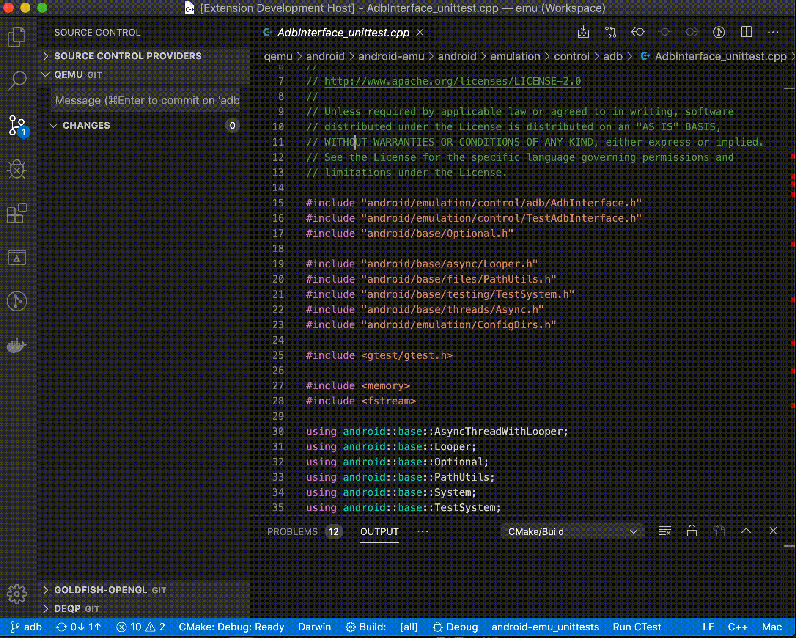

# Include What You Use

"Include what you use" means this: for every symbol (type, function variable, or macro) that you use in foo.cc, either foo.cc or foo.h should #include a .h file that exports the declaration of that symbol. The include-what-you-use tool is a program that can be built with the clang libraries in order to analyze #includes of source files to find include-what-you-use violations, and suggest fixes for them.

The main goal of include-what-you-use is to remove superfluous #includes. It does this both by figuring out what #includes are not actually needed for this file (for both .cc and .h files), and replacing #includes with forward-declares when possible.

## Features

Optimize the include files for the current C/C++ file:



## Requirements

You will need to install [include-what-you-use](https://include-what-you-use.org/). For example on mac:

```sh
brew install include-what-you-use
```

You must have a Python interpreter on the path that will be used. Both python 2/3 should work. This extension includes
code from include-what-you-use, which uses the LLVM license. See the [LICENSE](LICENSE) file for details.

## Extension Settings

This extension contributes the following settings:

- `iwyu.exe`: Path to the include what you use executable.
- `compile_commands` Path to compile_commands.json file.
- `iwyu.mapping_file`: Mapping file to use. See [IWYU Mappings](https://github.com/include-what-you-use/include-what-you-use/blob/master/docs/IWYUMappings.md) for details.
- `iwyu.transitive_includes_only`: Do not suggest that a file add foo.h unless foo.h is already visible in the file's transitive includes.
- `iwyu.max_line_length`: Maximum line length for includes.Note that this only affects comments and alignment thereof, the maximum line length can still be exceeded with long file names
- `iwyu.no_default_mappings`: Do not add iwyu's default mappings.
- `iwyu.no_fwd_decls`: Do not use forward declarations.
- `iwyu.keep`: A glob that tells iwyu to always keep these includes. Can be provided multiple times.
- `iwyu.additional_params`: Additional parameters you wish to pass to iwyu. Must be prefixed with a `-Xiwyu` flag

## Known Issues

- You will need a python interpreter on the path.

## Release Notes

### 1.0.2

- Fixed typo in mapping_file parameter.

### 1.0.1

- Add some additional properties.
- Removed `mapping_files` property and replaced it with single mapping file that can be set using `iwyu.mapping_file`
- Removed `why` option, as it can break automated fixing.
- Parse `compile_commands.json` when a change has been detected.
- Mention that a python interpeter is needed.
- Lower minimum version of vscode to 1.38.0

### 1.0.0

Initial release of include what you use.
